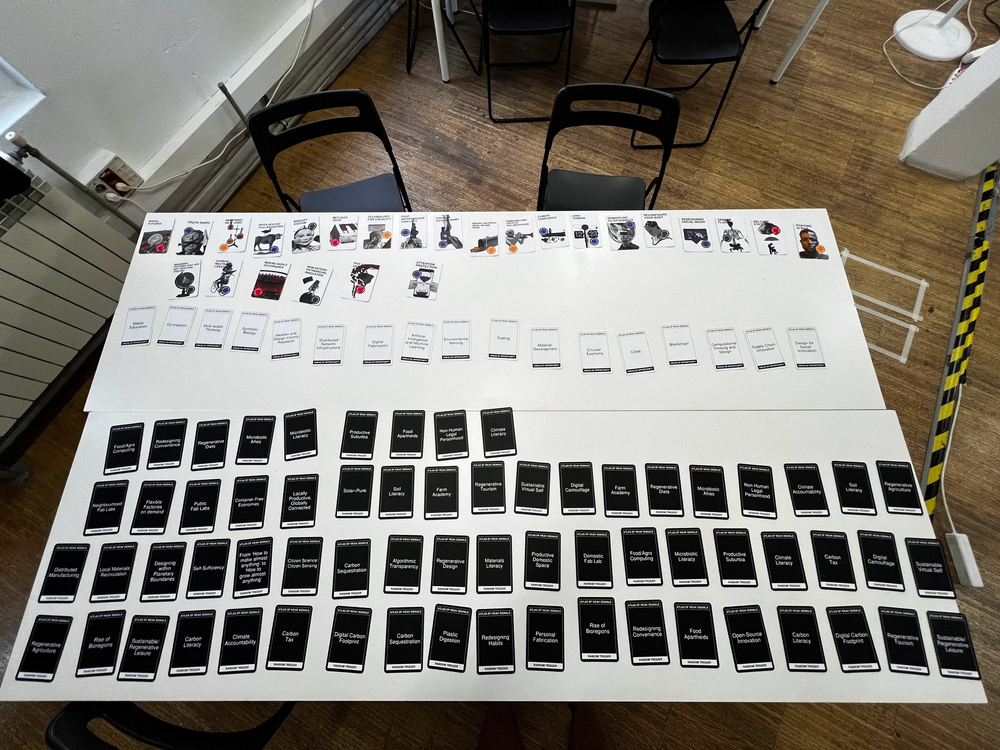
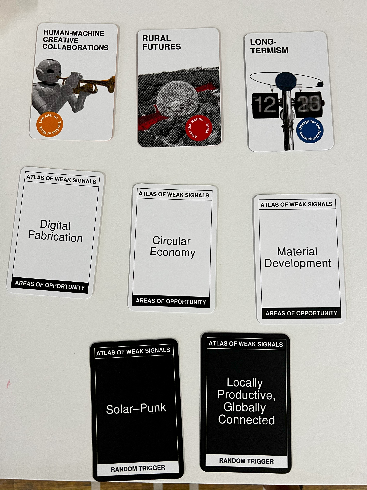

# Markdown Tech Support

---

<aside>
💡 Here you will find a comprehensive and ever growing list of different bits of code snippets that have helped make various aesthetic changes to the website written in markdown and hosted on git, there will be pieces of html and CSS, as well error codes with solutions. 😃

</aside>

## Images (sizing, alignment, etc)

### Round the corners of an image
<!--
<figure markdown style="overflow: hidden;">
{: style="height: 250px; width: auto; border-radius: 10px; margin-right: 10px"}
<figcaption>Narrowing down the cards I wanted to focus on</figcaption>
</figure>
-->


To add rounded corners to images in your code, you can use html. Here's how you can modify your code to achieve this:

<!--
```html
<figure markdown style="overflow: hidden;">
{: style="height: 250px; width: auto; border-radius: 10px; margin-right: 10px"}
<figcaption>Narrowing down the cards I wanted to focus on</figcaption>
</figure>
``` 
-->

```html

``` 
<!--
In this code:

- The `<figure>` element has inline styles added for `border-radius` to create rounded corners. Adjust the `10px` value to control the radius of the corners.
- The `overflow: hidden;` style ensures that the content outside the rounded corners is hidden.
- The `` element is used to identify it as an image and where to find it.
- The `style` attribute sets the height of the image to `250px` while maintaining the aspect ratio (`width: auto;`). Leaving the width or height as `auto;` will make sure that the image scales properly if you adjust one or the other or will place the image into the website at full size.
- The `margin-right:` attribute sets the amount of distance on the right had side of the image exists between it and the following image, it can be changed to added space top, bottom or left side.
You can also adjust the image height and width by adjusting the values of `height:` and `width:`
-->

You can adjust the `border-radius` value to make the corners more or less rounded according to your preference.

### Place two images next to each other
if you want to place two images next to eachother on the page you can use the following piece html:

```html
<div class="image-container">
    
    
</div>

<style>
/* CSS Styles */
.image-container {
    display: flex; /* Use flexbox to align images horizontally */
    justify-content: space-between; /* Add space between images */
}

.image-container img {
    width: 48%; /* Adjust the width of images as needed */
    height: auto; /* Maintain aspect ratio */
    object-fit: cover; /* Ensure the image covers the container while maintaining aspect ratio */
    border-radius: 5px; /* Add rounded corners to images */
}

.rounded-image {
    border-radius: 5px; /* Apply rounded corners to images with this class */
}
</style>
```
!!! info
    Right now this will display the images side by side on both desktop and mobile viewers, so even on a phone it'll still appear as a grid, I'm working on adding mobile responsiveness to the code so that the images display underneath eachother when viewed on a mobile display.

e.g. 
<div class="image-container">
    
    
</div>

<style>
/* CSS Styles */
.image-container {
    display: flex; /* Use flexbox to align images horizontally */
    justify-content: space-between; /* Add space between images */
}

.image-container img {
    width: 48%; /* Adjust the width of images as needed */
    height: auto; /* Maintain aspect ratio */
    object-fit: cover; /* Ensure the image covers the container while maintaining aspect ratio */
    border-radius: 5px; /* Add rounded corners to images */
}

.rounded-image {
    border-radius: 5px; /* Apply rounded corners to images with this class */
}
</style>

### multiple images in a grid
If you want to display multiple images on your page underneath eachother you can try putting them into a grid using html.

!!! info
    Right now this will display the images in a grid on both desktop and mobile viewers, so even on a phone it'll still appear as a grid, I'm working on adding mobile responsiveness to the code so that the images display underneath eachother when viewed on a mobile display.
<!--
```markdown
<figure markdown style="overflow: hidden;">
{: style="height: 250px; width: auto; border-radius: 10px; margin-right: 10px"}
{: style="height: 250px; width: auto; border-radius: 10px; margin-right: 10px"}
<figcaption>Narrowing down the cards I wanted to focus on</figcaption>
</figure>
```
-->

```html
<div class="image-grid">
  
  
  
  
  
  
  <!-- Add more images as needed -->
</div>

<!-- CSS Styles -->
<style>
  /* Styles for the image grid container */
  .image-grid {
    display: grid;
    grid-template-columns: repeat(2, 1fr); /* Two columns */
    /*grid-template-columns: repeat(auto-fill, minmax(200px, 1fr));*/ /*use this line of code to create a responsive grid that will place all images in one continuous row - each image will shrink accordignly*/
    grid-gap: 10px;
    /* Additional grid container styles can be added here */
  }

  /* Styles for individual grid items (images) */
  .grid-item {
    width: 100%;
    height: auto;
    object-fit: cover;
    border-radius: 5px; /* Add rounded corners to images */
    /* Additional styles for grid items can be added here */
  }
  /* Styles for portrait images */ /*apply this class to any portrait photo in a grid to crop it to landscape: class="grid-item portrait-image" */
.portrait-image {
    object-position: center middle; /* Adjust this property to control the cropping of portrait images */
  }
</style>
```
e.g. 
<!--<figure markdown style="overflow: hidden;">
{: style="height: 150px; width: auto; border-radius: 10px; margin-right: 10px"}
{: style="height: 150px; width: auto; border-radius: 10px; margin-right: 10px"}
<figcaption>Narrowing down the cards I wanted to focus on</figcaption>
</figure> -->
<div class="image-grid">
  
  
  
  
  
  
  <!-- Add more images as needed -->
</div>

<!-- CSS Styles -->
<style>
  /* Styles for the image grid container */
  .image-grid {
    display: grid;
    grid-template-columns: repeat(2, 1fr); /* Two columns */
    /*grid-template-columns: repeat(auto-fill, minmax(200px, 1fr));*/ /*use this line of code to create a responsive grid that will place all images in one continuous row - each image will shrink accordignly*/
    grid-gap: 10px;
    /* Additional grid container styles can be added here */
  }

  /* Styles for individual grid items (images) */
  .grid-item {
    width: 100%;
    height: auto;
    object-fit: cover;
    border-radius: 5px; /* Add rounded corners to images */
    /* Additional styles for grid items can be added here */
  }
  /* Styles for portrait images */ /*apply this class to any portrait photo in a grid to crop it to landscape: class="grid-item portrait-image" */
.portrait-image {
    object-position: center middle; /* Adjust this property to control the cropping of portrait images */
  }
</style>

## Text (alignment, font size, etc)

### Create a callout box:

In Markdown, you can create a callout box or highlight within a text paragraph using different techniques, depending on the features supported by the Markdown processor or the specific flavor of Markdown you are using. Here are a few common methods to create callout boxes or highlights:

### 1. **Using Blockquotes:**

You can use blockquotes (`>`) to create callout boxes. Most Markdown processors support blockquotes, and they are a standard feature in Markdown. Here's an example:

```markdown
> This is a callout box or highlight.
> It can span multiple lines.
```
> This is a callout box or highlight.
> It can span multiple lines.

**This makes something more similar to a quote box/bubble instead of specifically a callout box**

### 2. **Using HTML `<div>` Elements:**

You can use HTML `<div>` elements with inline CSS to create custom callout boxes or highlights. For example:

```markdown
<div style="background-color: #FFFFE0; padding: 10px; border: 1px solid #E6DB55;">
This is a custom callout box or highlight using HTML and CSS.
</div>
```
<div style="background-color: #FFFFE0; padding: 10px; border: 1px solid #E6DB55;">
This is a custom callout box or highlight using HTML and CSS.
</div>

Remember that `background-color:` affects the colour of the callout box, and `border: 1px solid` determines the colour and size of the outline of the callout box (this can be removed simply by deleting the border attribute from the text if you don’t want it). 

### 3. **Using Inline HTML with Styling:**

You can also use inline HTML with styling attributes directly within your Markdown content. For example:

```markdown
<span style="background-color: #FFFFE0; padding: 10px; border: 1px solid #E6DB55;">This is an inline callout box or highlight.</span>
```
<span style="background-color: #FFFFE0; padding: 10px; border: 1px solid #E6DB55;">This is an inline callout box or highlight.</span>

### 4. **Using Tables:**

You can create a table with a single cell to simulate a callout box:

```markdown
| Callout Box |
|-------------|
| This is a callout box or highlight. |

```
| Callout Box |
|-------------|
| This is a callout box or highlight. |

### 5. **Using Markdown Extensions:**

Some Markdown processors support extensions that provide additional features, including callout boxes. For example, the "Admonition" extension adds support for custom callout boxes:

```markdown
!!! info
    This is an info callout box.
```
!!! info
    This is an info callout box.

Note that the availability of certain features depends on the Markdown processor you are using and whether it supports specific extensions or custom HTML/CSS. Always refer to the documentation of the Markdown processor or the platform where you are rendering the Markdown for specific features and syntax supported.

### Round the corners of a callout box

To round the edges of a callout box or any other HTML element, you can use the `border-radius` CSS property. This property defines the radius of the element's corners. Here's how you can modify the previous examples to create a callout box with rounded edges:

### Using HTML `<div>` Elements:

```html
<div style="background-color: #FFFFE0; padding: 10px; border: 1px solid #E6DB55; border-radius: 10px;">
This is a custom callout box or highlight with rounded edges using HTML and CSS.
</div>
```
<div style="background-color: #FFFFE0; padding: 10px; border: 1px solid #E6DB55; border-radius: 10px;">
This is a custom callout box or highlight with rounded edges using HTML and CSS.
</div>

In this example, the `border-radius` property is set to `10px`, which rounds the corners of the callout box.

### Using Inline HTML with Styling:

```html
<span style="background-color: #FFFFE0; padding: 10px; border: 1px solid #E6DB55; border-radius: 10px;">
This is an inline callout box or highlight with rounded edges.
</span>

```
<span style="background-color: #FFFFE0; padding: 10px; border: 1px solid #E6DB55; border-radius: 10px;">
This is an inline callout box or highlight with rounded edges.
</span>

Again, the `border-radius` property is set to `10px` in this example to round the corners of the inline callout box.

You can adjust the value of `border-radius` to control how much rounding you want for the corners. A higher value will result in more rounded corners, while a lower value will result in less rounding. Feel free to experiment with different values until you achieve the desired appearance for your callout box.

### Centre align text:

In Markdown, you can't directly apply text alignment using Markdown syntax alone because Markdown is intentionally kept simple and doesn't provide extensive text formatting options. However, you can achieve text alignment by using HTML and inline CSS styles. Here's how you can center-align text in Markdown using HTML:

```html
<div style="text-align: center;">
This text is center-aligned using HTML and inline CSS.
</div>
```
<div style="text-align: center;">
This text is center-aligned using HTML and inline CSS.
</div>

In this example, the `<div>` element is styled with `text-align: center;`, which center-aligns the text inside the `<div>` element. When you use this code within your Markdown document, it will create a centered text block.

Remember that this approach involves using HTML, so depending on your Markdown renderer or platform, you might need to ensure that HTML rendering is enabled.

Always check the documentation or guidelines of the platform you're using to make sure using HTML in Markdown files is allowed and supported. 

Don’t worry, in MKdocs you can use HTML and CSS without any trouble.

### Centre align text within a callout box:

You can center the text inside a callout box using the HTML code I provided. Here's how you can create a centered text inside a callout box:

```html
<div style="text-align: center; border: 2px solid #ccc; padding: 10px; border-radius: 10px;">
This text is center-aligned inside a callout box using HTML and inline CSS.
</div>
```
<div style="text-align: center; border: 2px solid #ccc; padding: 10px; border-radius: 10px;">
This text is center-aligned inside a callout box using HTML and inline CSS.
</div>

In this example, I've added additional CSS properties to the `<div>` element:

- `border`: Adds a border around the callout box.
- `padding`: Adds space inside the callout box, so the text doesn't touch the border.
- `border-radius`: Rounds the corners of the callout box, creating a rounded appearance.

Adjust the values of `border`, `padding`, and `border-radius` to customize the appearance of your callout box further. This HTML code, when used within your Markdown document, will create a centered text inside a styled callout box. Remember to ensure that your platform supports and allows the use of HTML and inline CSS styles.

## Embedding

To embed your Miro board/map/video etc directly into your MkDocs documentation so that visitors can view the board without leaving your site, you can use an `<iframe>` HTML tag. Here's how you can do it:

```markdown
<iframe width="100%" height="600" src="<https://www.miro.com/app/board/board_id/>" frameborder="0" allowfullscreen></iframe>
```

Replace `https://www.miro.com/app/board/board_id/` with the actual URL of what you want.

In this example, the `<iframe>` tag is set to take up 100% of the width of its container and has a fixed height of 600 pixels. You can adjust the `width` and `height` attributes to fit your layout preferences.

Simply paste this code into your Markdown file where you want the embedded Miro board to appear. When users view your MkDocs documentation, they will see the embedded Miro board directly on the page.

### Centre embedded content

To center an embedded video in your Markdown file for your MKDocs website using the Material for MkDocs theme, you can use HTML to style the video container. Here's how you can embed and center a video using HTML and Markdown:

1. **Centering the Video:**
To center the video (or any other embeded content), you can wrap the `<iframe>` inside a `<div>` element and apply CSS styles to center the `<div>`. You can achieve this with the following HTML code:
    
    ```html
    <div style="text-align:center;">
        <iframe width="560" height="315" src="<https://www.youtube.com/embed/VIDEO_ID>" frameborder="0" allowfullscreen></iframe>
    </div>
    
    ```
    
    In this code, the `<div>` element is styled with `text-align: center;`, which horizontally centers its contents.
    
2. **Markdown Integration:**
If you want to include this in your Markdown file, simply paste the HTML code into your Markdown file. MKDocs allows you to use HTML within Markdown files.
    
    ```markdown
    Some Markdown content...
    
    <div style="text-align:center;">
        <iframe width="560" height="315" src="<https://www.youtube.com/embed/VIDEO_ID>" frameborder="0" allowfullscreen></iframe>
    </div>
    
    More Markdown content...
    
    ```
    

Remember to replace `VIDEO_ID` with the actual ID of your YouTube video. This approach will center the embedded video on your MKDocs website.

3. **Rounding the corners of an embed**

To round the corners of an embedded link include the following adjustment at the end of the embed link: 

```
allowfullscreen style="border-radius: 10px;"
```
the full embed code will then look like this: 

```
<iframe width="560" height="315" src="https://www.youtube.com/embed/jfKfPfyJRdk?si=0PktLmlkr21qPSie" title="YouTube video player" frameborder="0" allow="accelerometer; autoplay; clipboard-write; encrypted-media; gyroscope; picture-in-picture; web-share" allowfullscreen style="border-radius 10px;"></iframe>

```
Which when done right, should then look like this: 

<iframe width="100%" height="500" src="https://www.youtube.com/embed/Dbv4nmGdHDs?si=b40Knt8vFOFgAxG8" title="YouTube video player" frameborder="0" allow="accelerometer; autoplay; clipboard-write; encrypted-media; gyroscope; picture-in-picture; web-share" allowfullscreen style="border-radius: 30px;"></iframe>


Replace the link with whatever it is that you are embedding and it should be just fine! :D

## Hyperlinking

To turn a sentence into a hyperlink in Markdown, you can use the following syntax:

```markdown
[Your Sentence Here](URL)
```

Replace `Your Sentence Here` with the text you want to display as the hyperlink, and `URL` with the actual web address (URL) you want the sentence to link to. For example:

```markdown
[Visit Youtube's Website](https://www.youtube.com)
```
[Visit Youtube's Website](https://www.youtube.com)

In this example, the sentence "Visit youtube’s Website" will appear as a hyperlink, and clicking on it will take you to youtube.

Remember to replace `https://www.youtube.com` with the actual URL you want to link to.


## Colours

## Errors

<!-->
<div style="display:flex; justify-content:center; align-items:center; height:auto;">
  
</div> -->

<details>
<summary>How do I dropdown?</summary>
<br>
This is how you dropdown.
</details>
---
<details>
<summary>Heading</summary>
<!--All you need is a blank line-->

    + markdown list 1
        + nested list 1
        + nested list 2
    + markdown list 2
</details>
---
<details>
  <summary>Click to expand</summary>

  Your detailed content goes here.

  You can include **Markdown** *formatted* content within the collapsible section.
</details>

---

<div class="custom-collapsible">
    <div class="collapsible-header">
        Click to expand
    </div>
    <div class="collapsible-content">
        Your detailed content goes here.
        You can include **Markdown** *formatted* content within the collapsible section.
    </div>
</div>

<style>
.custom-collapsible {
    border: none;
    margin-bottom: 10px;
    border-radius: 5px;
}

.collapsible-header {
    background-color: #283617;
    padding: 10px;
    cursor: pointer;
}

.collapsible-content {
    padding: 10px;
    display: none;
}
</style>

<script>
document.querySelectorAll('.collapsible-header').forEach(function(header) {
    header.addEventListener('click', function() {
        var content = this.nextElementSibling;
        if (content.style.display === 'block') {
            content.style.display = 'none';
        } else {
            content.style.display = 'block';
        }
    });
});
</script>
---

<div class="custom-collapsible">
    <div class="collapsible-header">
        ▶ Click to expand
    </div>
    <div class="collapsible-content">
        Your detailed content goes here.
        You can include **Markdown** *formatted* content within the collapsible section.
    </div>
</div>

<style>
.custom-collapsible {
    border: 1px solid #ccc;
    margin-bottom: 10px;
    border-radius: 5px;
}

.collapsible-header {
    background-color: #f1f1f1;
    padding: 10px;
    cursor: pointer;
}

.collapsible-content {
    padding: 10px;
    display: none;
}
</style>

<script>
document.querySelectorAll('.collapsible-header').forEach(function(header) {
    header.addEventListener('click', function() {
        var content = this.nextElementSibling;
        if (content.style.display === 'block') {
            content.style.display = 'none';
            this.textContent = '▶ Click to expand';
        } else {
            content.style.display = 'block';
            this.textContent = '▼ Click to collapse';
        }
    });
});
</script>

---
## Comments
**If you've found this guide useful in any way, or think there is anything else I should add, please leave a comment down below! 👇**


